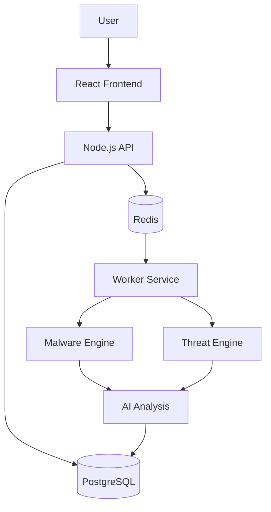

<!-- ===================================================== -->
<!-- 🔥 AEGIS-X - AI Enhanced SOC Platform -->
<!-- ===================================================== -->

<div align="center">


<p align="center">
  
</p>


</div>

---

# 🌌 Overview

**AEGIS-X** is an AI-augmented Security Operations Center (SOC) platform built to simulate real-world blue team workflows.

It integrates:

- 🔍 Malware sample analysis  
- 🌐 Threat intelligence classification  
- ⚙ Asynchronous job processing  
- 🤖 AI-driven reporting  
- 🔐 Role-Based Access Control (RBAC)  
- 📊 Risk scoring & executive summaries  

AEGIS-X mirrors the backend architecture of modern SIEM/SOAR-driven SOC environments.

---

# 🎯 Mission

> Build a modular, scalable, security-focused backend system that replicates how modern SOC teams ingest, process, analyze, and prioritize threats.

AEGIS-X demonstrates:

- Defensive security engineering
- Blue-team operational workflow
- AI-assisted threat triage
- Production-grade backend design
- Asynchronous distributed processing

---

# 🧠 Core Capabilities

---

## 🔬 Malware Analysis Engine

✔ Secure file ingestion  
✔ MIME validation & size control  
✔ Entropy analysis  
✔ String extraction  
✔ Suspicious keyword detection  
✔ Simulated YARA rule matching  
✔ MD5 & SHA256 hashing  
✔ AI behavior explanation  
✔ Executive-level summary generation  
✔ Risk score calculation  

---

## 🌐 Threat Classification Engine

✔ Log ingestion  
✔ Indicator extraction  
✔ AI classification  
✔ Risk enrichment  
✔ Metadata tagging  
✔ SOC-style contextualization  

---

## ⚙ Asynchronous Processing (Redis + BullMQ)

AEGIS-X uses a distributed worker architecture:

```
Client → API → Redis Queue → Worker → AI → PostgreSQL
```

Supports:

- Retry with exponential backoff
- Failure handling
- Status tracking
- Real-time updates
- Concurrent job execution

---

## 🔐 Role-Based Access Control (RBAC)

Roles:

- ADMIN
- SOC_ANALYST
- MALWARE_ANALYST
- PENTESTER
- VIEWER

Implements:

- JWT authentication
- Route authorization middleware
- Token expiration handling
- Secure password hashing

---

# 🏗️ Architecture



---

# 🗃️ Database Design

Key tables:

- users
- roles
- malware_reports
- analysis_jobs
- logs
- incident_events

Uses:

- JSONB storage
- Upsert conflict handling
- Job state persistence
- Risk metadata tracking

---

# 🤖 AI Integration Layer

AI assists in:

- Behavioral explanation
- Executive summaries
- Threat categorization
- Risk contextualization
- Incident summarization

All AI outputs are stored in structured JSON for:

- Dashboard rendering
- Audit trail
- Future enrichment

---

# 📊 Risk Scoring Model

Risk Score considers:

- Entropy threshold
- YARA matches
- Suspicious keywords
- Indicator density
- Behavioral patterns

Severity classification:

| Level | Meaning |
|--------|----------|
| 🔴 Critical | Immediate threat |
| 🟠 High | Exploitable vector |
| 🟡 Medium | Suspicious |
| 🟢 Low | Informational |

---

# 🛠️ Tech Stack

| Layer | Tech |
|--------|------|
| Backend | Node.js + Express |
| Language | TypeScript |
| DB | PostgreSQL 16 |
| Queue | Redis 7 |
| Worker | BullMQ |
| Frontend | React |
| Auth | JWT |
| Containerization | Docker |

---

# 🚀 Getting Started

## 🐳 Run via Docker

```bash
docker-compose build --no-cache
docker-compose up
```

Access:

```
http://localhost:5000
```

---

## 🧪 Local Development

```bash
cd server
npm install
npm run build
npm run dev
```

---

# 🔒 Security Design Highlights

- File upload validation
- Rate limiting
- JWT expiration enforcement
- Controlled worker execution
- Structured error handling
- RBAC route protection
- Asynchronous isolation
- Secure environment variable management

---

# 🎓 Educational Value

AEGIS-X teaches:

- SOC operational flow
- Malware triage lifecycle
- Worker-based system architecture
- Risk-based prioritization
- Secure backend engineering
- Database conflict resolution
- Queue-based scalability

---

# 🧠 Engineering Concepts Demonstrated

- Multi-stage Docker builds
- Production TypeScript configuration
- Redis job orchestration
- AI enrichment pipelines
- Secure service modularization
- Event-driven architecture
- Clean separation of concerns

---

# ⚠ Disclaimer

AEGIS-X is built for:

- Educational use
- Security engineering learning
- Blue team workflow simulation

It is not a production SIEM or malware sandbox.

---

# 👨‍💻 Author

**Anandhan**  
Security Engineering & Web3 Security Research Enthusiast  
India 🇮🇳  

---

<div align="center">


</div>
